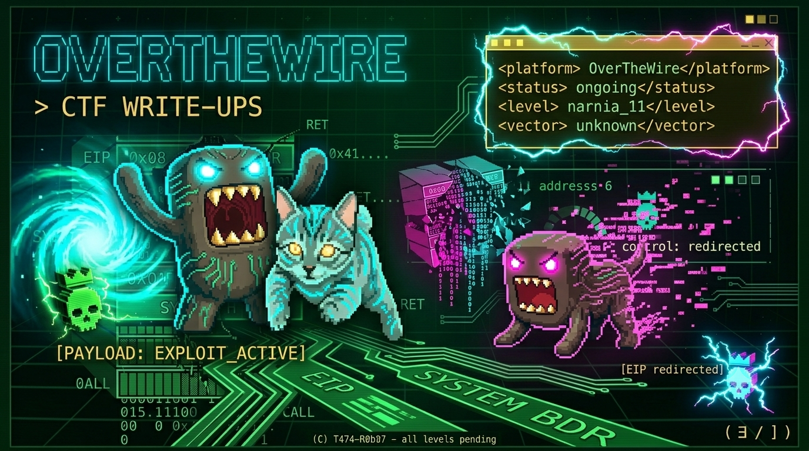

```
 ██████╗ ██╗   ██╗███████╗██████╗ ████████╗██╗  ██╗███████╗██╗    ██╗██╗██████╗ ███████╗
██╔═══██╗██║   ██║██╔════╝██╔══██╗╚══██╔══╝██║  ██║██╔════╝██║    ██║██║██╔══██╗██╔════╝
██║   ██║██║   ██║█████╗  ██████╔╝   ██║   ███████║█████╗  ██║ █╗ ██║██║██████╔╝█████╗
██║   ██║╚██╗ ██╔╝██╔══╝  ██╔══██╗   ██║   ██╔══██║██╔══╝  ██║███╗██║██║██╔══██╗██╔══╝
╚██████╔╝ ╚████╔╝ ███████╗██║  ██║   ██║   ██║  ██║███████╗╚███╔███╔╝██║██║  ██║███████╗
 ╚═════╝   ╚═══╝  ╚══════╝╚═╝  ╚═╝   ╚═╝   ╚═╝  ╚═╝╚══════╝ ╚══╝╚══╝ ╚═╝╚═╝  ╚═╝╚══════╝
```



```bash
$ whoami
> t474_r0b07

$ pwd
> /writeups/overthewire

$ cat /etc/mission
> 3st3 n0 3s 3l lug4r d0nd3 4pr3ndí qu3 3x1st14n l4s vuln3r4b1l1d4d3s.
> 3s 3l lug4r d0nd3 3nt3ndí qu3 y0 p0dí4 3ncontr4rl4s.
```

---

## `> cat arrival.txt`

```bash
$ ssh bandit0@bandit.labs.overthewire.org -p 2220
```

Esa línea cambió algo.

No el comando. No el puerto. No el servidor.
El hecho de que funcionó — y del otro lado había un problema
que nadie iba a resolver por mí.

Antes de esto había hecho TryHackMe.
21 salas. Top 25%. Un día.
No porque sea bueno — porque las respuestas casi venían escritas
en los campos de texto.
No hubo resistencia. No hubo fricción.
No hubo nada que costara.

OverTheWire fue diferente desde el primer prompt.
La terminal no te guía. No te da pistas visuales.
No hay botón de hint.
Solo hay un servidor esperando
que sepas qué preguntarle.

Eso fue lo que me enganchó.

---

## `> cat context.txt`

```
no vine aquí a aprender comandos.
vine aquí porque algo no funcionó
y tuve que entender por qué.

  eso es diferente.
```

Bandit enseña a moverse.
Leviathan enseña a observar.
Narnia enseña a pensar diferente.

No son niveles de dificultad.
Son formas distintas de ver el mismo sistema.

```bash
$ echo $TURNING_POINT
> narnia.
> primer nivel que realmente costó.
> primer nivel que valió la pena documentar.
```

---

## `> ls -la series/`

```bash
SERIE         NIVELES    STATUS         TERRITORIO
────────────  ─────────  ─────────────  ──────────────────────────────────
B4nd1t/       [34/34]    ✅ completo    movimiento · orientación · terminal
L3v14th4n/    [08/08]    ✅ completo    observación · SUID · señales
N4rn14/       [12/12]    ✅ completo    stack · heap · entorno · memoria
B3h3m0th/     [00/??]    🔴 iniciando  // territorio desconocido
```

---

## `> cat methodology.txt`

```diff
+ cada nivel · mismo mapa · siempre:

  [RECON]       qué vi primero
  [HYPOTHESIS]  qué creí que era
  [ATTEMPTS]    qué intenté. qué falló. todo.
  [BREAK]       el momento exacto en que algo hizo clic
  [FLAG]        el resultado
  [REFLECTION]  qué haría diferente

- [ATTEMPTS] es donde vive el aprendizaje real.
- no en la flag.
- nunca en la flag.
```

---

## `> cat rules.conf`

```ini
[wargame]
hints          = false
walkthroughs   = false
copy_paste     = false
friction       = required

[philosophy]
; la terminal no te guía.
; el servidor no te explica.
; o entiendes lo que está pasando
; o no pasa nada.
```

---

## `> cat lore.txt`

```bash
$ ls ../lore/
```

Cada writeup genera referencias.
Cada referencia tiene su entrada en la biblioteca.

```
/lore/aleph_one.md          → el texto que lo formalizó todo
/lore/gusano_morris.md      → el primer exploit masivo
/lore/solar_designer.md     → el que cerró una ventana y abrió otra
/lore/nergal.md             → Bugtraq 1998 · ret-into-libc
/lore/nergal_phrack58.md    → Phrack 2001 · el blueprint de ROP
/lore/ken_thompson.md       → Trusting Trust · 1984
/lore/stealth_got.md        → GOT overwrite · el directorio abierto
/lore/y2k.md                → el número que el mundo no entendió
/lore/klog_phrack55.md      → un byte · todo el cimiento
/lore/execve_envp.md        → el tercer argumento que nadie lee
/lore/once_upon_free.md     → Phrack 57 · el heap tiene estructura
```

> El lore no es decoración.
> Es el sustento técnico de cada decisión documentada.
> Si algo aparece referenciado en un writeup,
> su historia completa está ahí.

---

## `> tail -f progress.log`

```
🟢  Bandit      [██████████] 34/34   completo
🟢  Leviathan   [██████████] 08/08   completo
🟢  Narnia      [██████████] 12/12   completo · stack · heap · entorno
🔴  Behemoth    [░░░░░░░░░░] 00/??   // inicializando...
```

---

## `> cat /var/log/sys.log | tail -1`

```
[♟] 54 68 65 20 73 79 73 74 65 6d 20 77 61 73 20 6e
    6f 74 20 62 72 6f 6b 65 6e 20 74 68 65 20 64 61
    79 20 6f 66 20 74 68 65 20 61 74 74 61 63 6b 2e
    20 49 74 20 77 61 73 20 62 72 6f 6b 65 6e 20 74
    68 65 20 64 61 79 20 73 6f 6d 65 6f 6e 65 20 61
    73 73 75 6d 65 64 20 69 74 20 77 61 73 20 73 61 66 65 2e
```

---

<details>
<summary><code>// 1f y0u r34d th1s, y0u w3r3 4lr34dy l00k1ng</code></summary>

```bash
$ cat /hidden/origin.txt

> bandit0.
> un ssh. un puerto. un servidor del otro lado.
> nadie te dijo qué preguntar.
> tuviste que descubrirlo.
>
> eso fue suficiente para no parar.
```

</details>

---

> *// l1v3 pr0c3ss · 3sp4ñ0l · 3rr0r3s 1nclU1d0s*
 *→[https://youtube.com/t474-r0b07](https://youtube.com/@kaderd.garnica?si=9vk1E6Gkkb7LftTK)*
> *→ [github.com/t474-r0b07/ctf-writeups](https://github.com/t474-r0b07/ctf-writeups)*

---

<!--
  "The obstacle is the way."
                — Marcus Aurelius
-->
