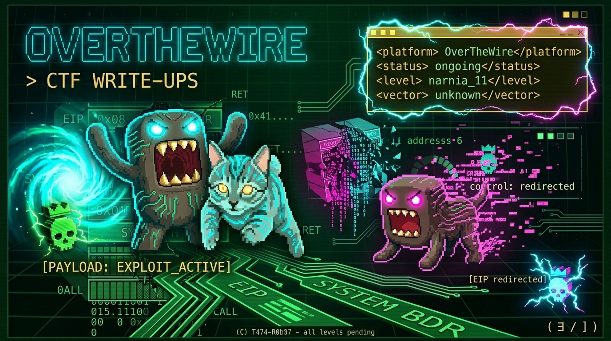

# Narnia



> OverTheWire / Narnia · 12 niveles completados

Narnia es la parte de OverTheWire donde la terminal deja de ser solamente una herramienta de navegación y empieza a convertirse en un laboratorio de memoria, ejecución y explotación.

La serie recorre vulnerabilidades y técnicas clásicas sobre binarios Linux: **stack overflows, variables de entorno, control de EIP/EBP, GOT, off-by-one, `execve`, corrupción de heap y function pointers**.

---

## `> ls levels/`

| Nivel | Writeup | Estado |
|---|---|---|
| 00 | [narnia00](./narnia00.md) | ✅ completo |
| 01 | [narnia01](./narnia01.md) | ✅ completo |
| 02 | [narnia02](./narnia02.md) | ✅ completo |
| 03 | [narnia03](./narnia03.md) | ✅ completo |
| 04 | [narnia04](./narnia04.md) | ✅ completo |
| 05 | [narnia05](./narnia05.md) | ✅ completo |
| 06 | [narnia06](./narnia06.md) | ✅ completo |
| 07 | [narnia07](./narnia07.md) | ✅ completo |
| 08 | [narnia08](./narnia08.md) | ✅ completo |
| 09 | [narnia09](./narnia09.md) | ✅ completo |
| 10 | [narnia10](./narnia10.md) | ✅ completo |
| 11 | [narnia11](./narnia11.md) | ✅ completo |

---

## `> cat methodology.txt`

Cada nivel sigue el mismo mapa:

```text
[RECON]       qué vi primero
[HYPOTHESIS]  qué creí que estaba pasando
[ATTEMPTS]    qué intenté y qué falló
[BREAK]       el momento en que el modelo encajó
[EXPLOIT]     cómo se convirtió la hipótesis en control
[FLAG]        el resultado
[REFLECTION]  qué aprendí y qué haría diferente
```

Los errores forman parte del writeup. La flag no es el objetivo de la documentación; entender por qué funcionó, sí.

---

## `> cat terrain.txt`

```text
Narnia 00–01   → stack · variables · overflow
Narnia 02–04   → EIP · shellcode · GOT · control de ejecución
Narnia 05–06   → memoria · formatos · punteros
Narnia 07–09   → GOT · entorno · off-by-one · EBP
Narnia 10      → execve · envp · contexto de ejecución
Narnia 11      → heap · function pointers · corrupción de objetos
```

Los detalles concretos están en cada writeup. Las direcciones y offsets que aparecen allí deben entenderse como valores dependientes del entorno de ejecución, no como constantes universales.

---

## `> cat lore.txt`

Narnia está conectado con una biblioteca de referencias históricas y técnicas.

- [Solar Designer](../../lore/solar_designer.md)
- [Ken Thompson](../../lore/ken_thompson.md)
- [Nergal](../../lore/nergal.md)
- [ProFTP 2000](../../lore/proftp_2000.md)
- [Nergal · Phrack 58](../../lore/nergal_phrack58.md)
- [Stealth GOT](../../lore/stealth_got.md)
- [Y2K](../../lore/y2k.md)
- [Klog · Phrack 55](../../lore/klog_phrack55.md)
- [execve / envp](../../lore/execve_envp.md)
- [once upon a free()](../../lore/once_upon_free.md)

→ [Índice completo del lore](../../lore/readme.md)

---

## `> cat rules.conf`

```ini
[hasta donde llega el writeup]
hints        = no
walkthroughs = no
copy_paste   = no
friction     = required
```

La documentación muestra el razonamiento y los errores, no sustituye el proceso de análisis.

---

## `> tail -f progress.log`

```text
🟢  Narnia      [██████████] 12/12   completo
```

---

> *// proceso activo · español · errores incluidos*  
> *→ [youtube.com/@Tata_Robot](https://www.youtube.com/@Tata_Robot)*  
> *→ [github.com/t474-r0b07/ctf-writeups](https://github.com/t474-r0b07/ctf-writeups)*

---

> *← [OverTheWire](../README.md)*

<!-- narnia · t474-r0b07 · stack · heap · entorno · memoria -->
